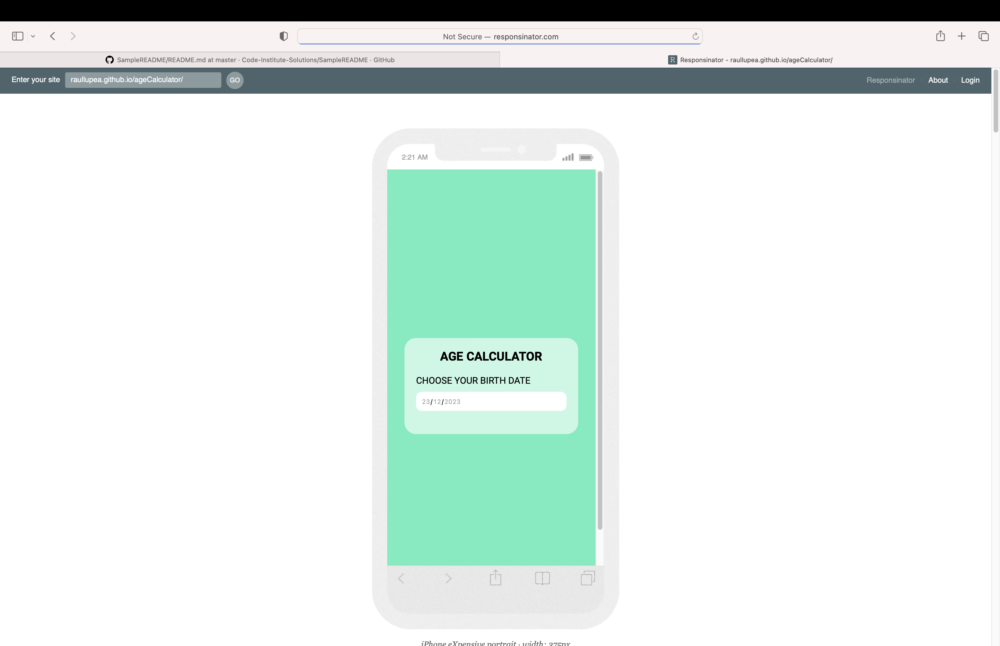
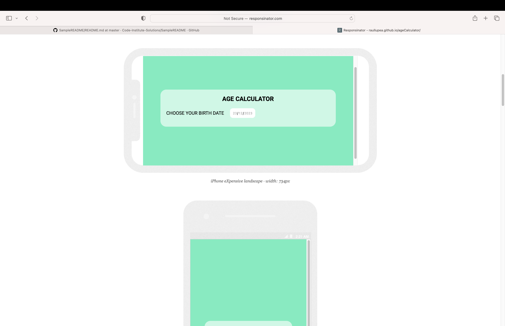
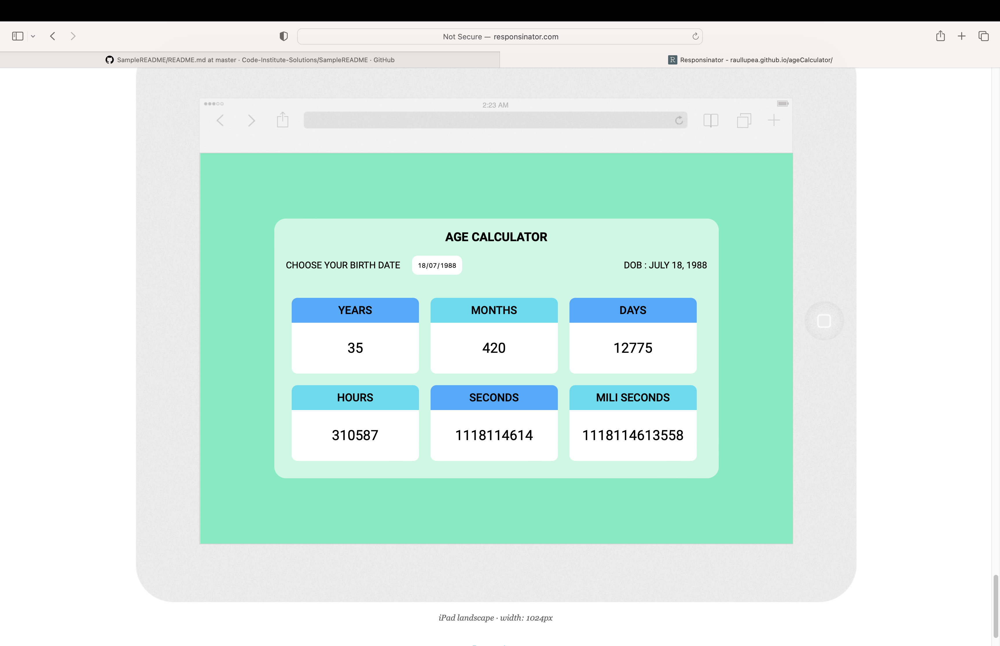
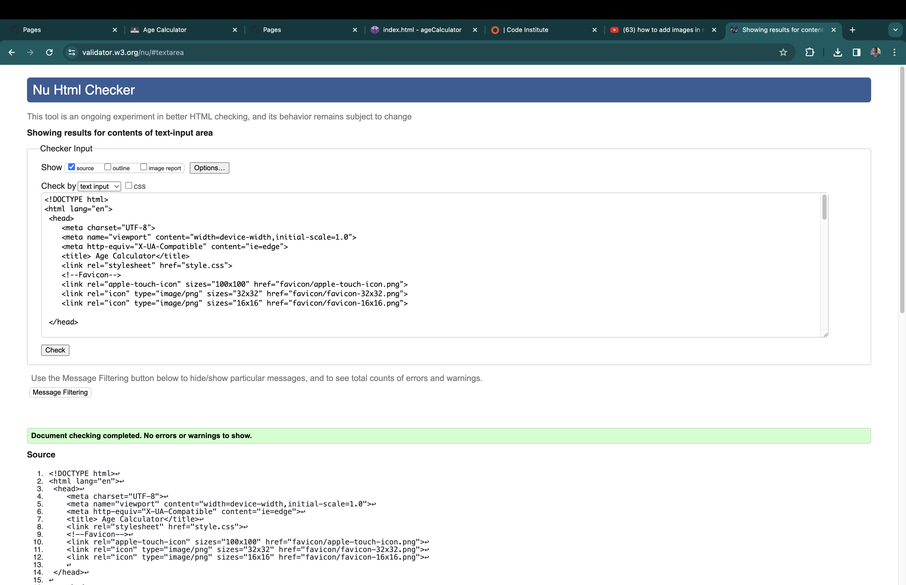
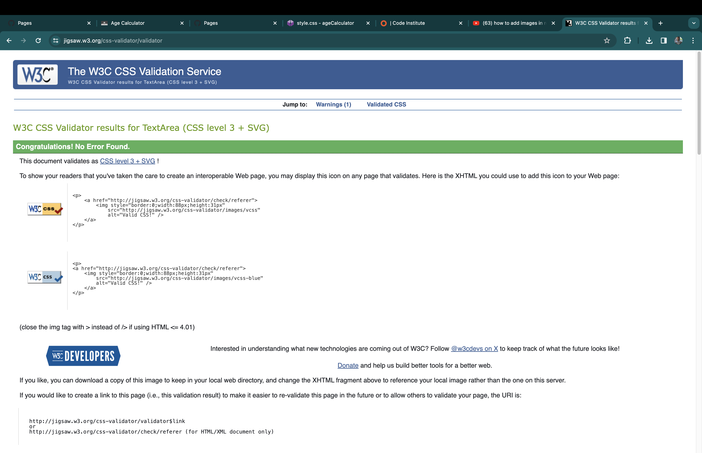
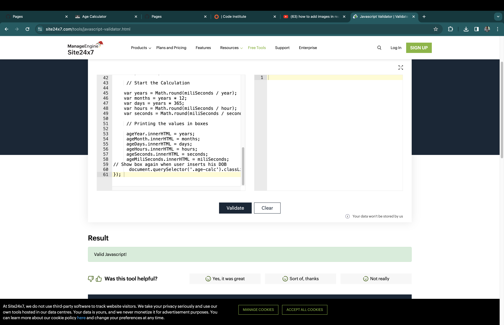

<h1 align="center">Age Calculator</h1>

[View the live project here.](https://raullupea.github.io/ageCalculator/)

It is designed to be responsibe and accessible on a range of devices, making it easy to use for everyone on all sort of device screens from small to large.
[small scrrens](;)
[](;)
[](;)


## User Experience (UX)

-   ### User stories

    -   #### First Time Visitor Goals

        1. As a First Time Visitor, I want to easily understand the main purpose of the site and learn more about the app
        2. As a First Time Visitor, I want to be able to easily navigate throughout the site to find content.
        3. As a First Time Visitor, I want to look for testimonials to understand what their users think of them and see if they are trusted. I also want to locate their social media links to see their followings on social media to determine how trusted and known they are.

    -   #### Returning Visitor Goals

        1. As a Returning Visitor, I want to find information about the app.
        


-   ### Design
    -   #### Colour Scheme
        -   The two main colours used are light green with the code #62edbe and white.
    -   #### Typography
        -   The Roboto is a neo-grotesque sans-serif typeface family developed by Google as the system font for its mobile operating system, Android, and released in 2011 for Android 4.0 "Ice Cream Sandwich".
    -  

*   ### Wireframes

    -   Home Page Wireframe - [View](https://raullupea.github.io/ageCalculator/)

    -   Mobile Wireframe - [View](https://raullupea.github.io/ageCalculator/

    -   Contact Us Page Wireframe - [View](https://raullupea.github.io/ageCalculator/)

## Features

-   Responsive on all device sizes

-   Interactive elements


### Languages Used

-   [HTML5](https://en.wikipedia.org/wiki/HTML5)
-   [CSS3](https://en.wikipedia.org/wiki/Cascading_Style_Sheets)
-  [JavaScript] (https://en.wikipedia.org/wiki/JavaScript)
### Frameworks, Libraries & Programs Used


1. [Google Fonts:](https://fonts.google.com/)
    - Google fonts were used to import the 'Titillium Web' font into the style.css file which is used on all pages throughout the project.
1. [Font Awesome:](https://fontawesome.com/)
    - Font Awesome was used on all pages throughout the website to add icons for aesthetic and UX purposes.

1. [Git](https://git-scm.com/)
    - Git was used for version control by utilizing the Gitpod terminal to commit to Git and Push to GitHub.
1. [GitHub:](https://github.com/)
    - GitHub is used to store the projects code after being pushed from Git.


## Testing

The W3C Markup Validator and W3C CSS Validator Services were used to validate every page of the project to ensure there were no syntax errors in the project.

-   [W3C Markup Validator](https://jigsaw.w3.org/css-validator/#validate_by_input) - [Results](;)
-   [W3C CSS Validator](https://jigsaw.w3.org/css-validator/#validate_by_input) - [Results](;)
- [JavaScript Validator](https://www.site24x7.com/tools/javascript-validator.html) -[Result](;)
### Testing User Stories from User Experience (UX) Section

-   #### First Time Visitor Goals

    1. As a First Time Visitor, I want to easily understand the main purpose of the site and learn more about the organisation.

        1. Upon entering the site, user will come across an Age Calculator bar with the title AGE CALCULATOR. Underneath there is a input box where user can select his date of birth by clicking and scrolling on the numbers shown in the grid.
        2. After selecting the date of birth a box will pop down with 6 containers containing information about the date inserted previously.
        3. In the six containers bellow  you will find information regarding users age spread over a format of : years ,months ,days,hours,seconds,miliseconds .

    
        1. The site has been designed to be fluid and never to entrap the user. To restart the page simply refresh the window from the refresh arrow and the input box will come again on the screen.
        
    
-   

    
### Further Testing

-   The Website was tested on Google Chrome, Internet Explorer, Microsoft Edge and Safari browsers.
-   The website was viewed on a variety of devices such as Desktop, Laptop, iPhone7, iPhone 8 & iPhoneX.
-   A large amount of testing was done to ensure that all pages were linking correctly.
-   Friends and family members were asked to review the site and documentation to point out any bugs and/or user experience issues.


## Deployment

### GitHub Pages

The project was deployed to GitHub Pages using the following steps...

1. Log in to GitHub and locate the [GitHub Repository](https://github.com/raullupea/ageCalculator)
2. At the top of the Repository (not top of page), locate the "Settings" Button on the menu.
    - Alternatively Click [Here](https://raw.githubusercontent.com/) for a GIF demonstrating the process starting from Step 2.
3. Scroll down the Settings page until you locate the "GitHub Pages" Section.
4. Under "Source", click the dropdown called "None" and select "Master Branch".
5. The page will automatically refresh.
6. Scroll back down through the page to locate the now published site [link](https://raullupea.github.io/ageCalculator/) in the "GitHub Pages" section.

### Forking the GitHub Repository

By forking the GitHub Repository we make a copy of the original repository on our GitHub account to view and/or make changes without affecting the original repository by using the following steps...

1. Log in to GitHub and locate the [GitHub Repository](https://github.com/)
2. At the top of the Repository (not top of page) just above the "Settings" Button on the menu, locate the "Fork" Button.
3. You should now have a copy of the original repository in your GitHub account.

### Making a Local Clone

1. Log in to GitHub and locate the [GitHub Repository](https://github.com/)
2. Under the repository name, click "Clone or download".
3. To clone the repository using HTTPS, under "Clone with HTTPS", copy the link.
4. Open Git Bash
5. Change the current working directory to the location where you want the cloned directory to be made.
6. Type `git clone`, and then paste the URL you copied in Step 3.

```
$ git clone https://github.com/YOUR-USERNAME/YOUR-REPOSITORY
```

7. Press Enter. Your local clone will be created.

```
$ git clone https://github.com/YOUR-USERNAME/YOUR-REPOSITORY
> Cloning into `CI-Clone`...
> remote: Counting objects: 10, done.
> remote: Compressing objects: 100% (8/8), done.
> remove: Total 10 (delta 1), reused 10 (delta 1)
> Unpacking objects: 100% (10/10), done.
```

Click [Here](https://help.github.com/en/github/creating-cloning-and-archiving-repositories/cloning-a-repository#cloning-a-repository-to-github-desktop) to retrieve pictures for some of the buttons and more detailed explanations of the above process.

## Credits


-   [Bootstrap4](https://getbootstrap.com/docs/4.4/getting-started/introduction/): Bootstrap Library used throughout the project mainly to make site responsive using the Bootstrap Grid System.

-   [MDN Web Docs](https://developer.mozilla.org/) : For Pattern Validation code. Code was modified to better fit my needs and to match an Irish phone number layout to ensure correct validation. Tutorial Found [Here](https://developer.mozilla.org/en-US/docs/Web/HTML/Element/input/tel#Pattern_validation)

### Content

-   All content was written by the developer.

-   Psychological properties of colours text in the README.md was found [here](http://www.colour-affects.co.uk/psychological-properties-of-colours)


### Acknowledgements

-   My Mentor for continuous helpful feedback.

-   Tutor support at Code Institute for their support.